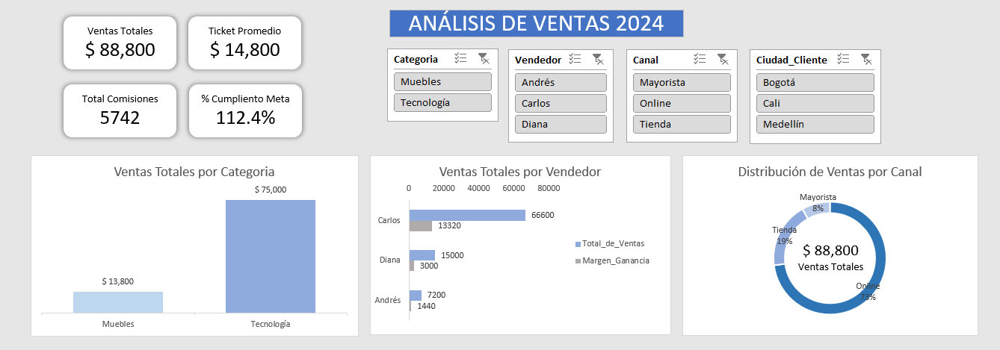

# 📊 Dashboard Ejecutivo de Análisis de Ventas en Excel

## 📌 Descripción del Proyecto

Este proyecto consiste en el desarrollo de un Dashboard Ejecutivo de Ventas en Microsoft Excel, diseñado para analizar el desempeño comercial de una empresa mediante indicadores clave de rendimiento (KPIs), gráficos dinámicos y visualización profesional orientada a la toma de decisiones.

El dashboard permite monitorear métricas estratégicas como ventas totales, ticket promedio y cumplimiento de metas, integrando segmentadores y tablas dinámicas para análisis interactivo.

---

## 🎯 Objetivos del Proyecto

- Diseñar un dashboard profesional con enfoque ejecutivo.
- Implementar KPIs dinámicos vinculados a datos reales.
- Crear indicadores visuales para facilitar la interpretación rápida.
- Automatizar cálculos mediante fórmulas avanzadas.
- Proteger la estructura del dashboard sin afectar la interactividad.
- Aplicar buenas prácticas de diseño y organización de datos.

---

## 📈 Funcionalidades Implementadas

- Dashboard dinámico conectado a tablas dinámicas.
- KPIs calculados automáticamente:
  - Ventas Totales
  - Ticket Promedio
  - % Cumplimiento de Meta
- Indicadores visuales (flechas / semáforos) basados en lógica condicional.
- Segmentadores para filtrado interactivo.
- Formas vinculadas a celdas para mostrar métricas dinámicamente.
- Protección de hoja sin afectar gráficos dinámicos.
- Diseño limpio con formato profesional y jerarquía visual.

---

## 🧮 Fórmulas y Conceptos Utilizados

- PROMEDIO()
- SUMA()
- SUMAR.SI.CONJUNTO()
- Referencias estructuradas con Tablas (tbl_Ventas)
- Fórmulas condicionales para indicadores visuales
- Formato condicional
- Celdas auxiliares para lógica de KPIs
- Vinculación de formas a celdas
- Protección de hoja con objetos desbloqueados

---

## 🧠 Conceptos Técnicos Aplicados

- Modelado de datos en Excel
- Separación entre datos, cálculos y visualización
- Uso de tablas estructuradas
- Diseño de dashboards ejecutivos
- Automatización sin uso de VBA
- Control de interacción del usuario
- Visualización orientada a negocio

---

## 💼 Problema que Resuelve

Este dashboard permite a un gerente comercial:

- Monitorear el rendimiento de ventas en tiempo real.
- Detectar rápidamente desviaciones respecto a la meta.
- Analizar desempeño por categoría.
- Tomar decisiones basadas en indicadores claros y visuales.

Reduce el tiempo de análisis manual y mejora la claridad en la presentación de resultados.

---

## 🔒 Control y Protección

Se implementó:

- Bloqueo estructural del dashboard.
- Desbloqueo de gráficos dinámicos y segmentadores.
- Protección sin afectar la actualización de tablas dinámicas.

Esto garantiza integridad del diseño sin limitar la interacción del usuario.

---

## 📊 Vista Previa

